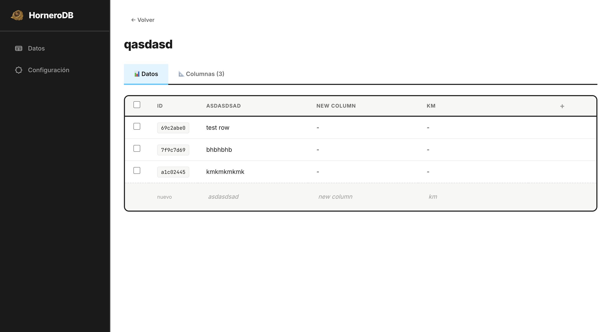

# 🐦 HorneroDB

**Open-source, low-code database built in Go + React.**  
Self-hostable alternative to Airtable, NocoDB, PocketBase and Baserow. Secure by default with Passkeys powered by PocketID SSO.



## ✨ Features

- **Dynamic Tables & Columns** — create schemas on the fly via UI or API
- **14 Field Types** — Text, Number, Bool, Date, Email, URL, JSON, Relation, File, etc.
- **Excel-like Editing** — Inline cell editing, keyboard navigation, copy/paste
- **Role-Based Access** — Granular permissions per table, column, and row (Dataverse-style)
- **OIDC Authentication** — Integrated with PocketID, EntraID, Keycloak
- **MCP Server** — First-class support for AI agents (Claude, OpenCode, Antigravity)
- **Multi-tenant** — Isolated workspaces for different teams or projects
- **Simplified Deployment** — Warm up database + setup the auth service of your preference and you are ready to go


## 🚀 Quick Start


### Quick deploy in the Playground provided by the Docker friends

[Run it in Play with Docker](https://labs.play-with-docker.com/?stack=https://raw.githubusercontent.com/lucahttp/HorneroDB/refs/heads/main/docker-compose.yml&stack_name=HorneroDB)


[](https://labs.play-with-docker.com/?stack=https://raw.githubusercontent.com/lucahttp/HorneroDB/refs/heads/main/docker-compose.yml&stack_name=HorneroDB)


### Prerequisites
- `.env` variables setup (PocketID values are generated after running Docker)
- Docker


`* for development you need this runtimes to run it locally`
- NodeJS
- Go


### Docker way

```bash
# create .env file
cp .env.example .env

# put you values

# run docker compose to get PocketID and PostgreSQL running
docker-compose up -d
```
Visit `http://localhost:5173` (default port).


### Manual

```bash
# Backend
go build -o bin/hornerodb ./cmd/server
./bin/hornerodb

# Frontend (dev)
cd web/ui && npm run dev
```

Visit `http://localhost:8090` (default port).

## 📚 API Reference

Comprehensive OpenAPI 3.0 documentation available at [`docs/openapi.yaml`](docs/openapi.yaml).

### Key Endpoints

- `GET /api/v1/workspaces`
- `GET /api/v1/workspaces/:ws/tables`
- `GET /api/v1/workspaces/:ws/data/:slug`
- `POST /api/v1/workspaces/:ws/data/:slug`

## 🛠 Stack

- **Backend:** Go, Gin, GORM, PostgreSQL
- **Frontend:** React, Vite, Framer Motion, Iconoir
- **Auth:** OIDC (PocketID)


## 🗺 Roadmap

- [x] Full REST API (30+ endpoints)
- [x] OIDC Auth & RBAC Permissions
- [x] MCP Server
- [x] Visual Table Editor & Inline Editing
- [x] PocketBase-style Field Types
- [ ] Table Relations UI
- [ ] Filters & Search
- [ ] Webhooks & Automation
- [ ] S3 Attachments

---

## 🐦  Fun fact
The [Hornero](https://en.wikipedia.org/wiki/Hornero) is Argentina's national bird. They build nests made of mud and twigs shaped like mud ovens.


Made in Argentina with ❤️
