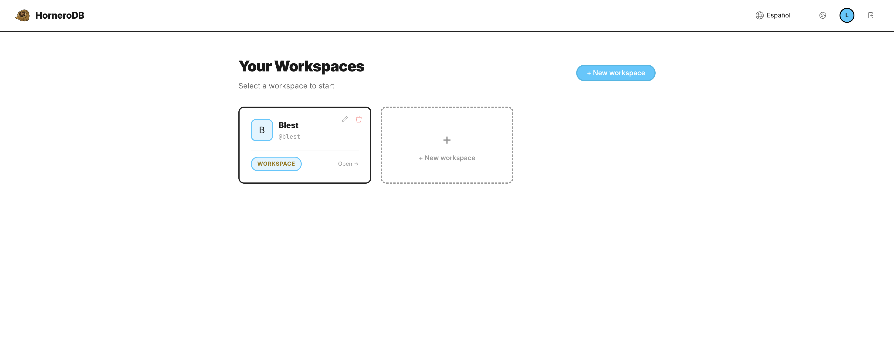

# 🐦 HorneroDB

[English](#english) | [Español](#español)

---

<a name="english"></a>
## English Version

### Wanna vibecode an e-commerce, or build it by hand?
But... What about the website's data? The actual database? Permissions and access control?

Your *vibecoded* app can have its **data protected just like large enterprises (enterprise grade)** using the highest security standards. That's what **HorneroDB** is for.

**Built with Go + React (Optional).** A CRM / database in the style of Airtable, NocoDB, or PocketBase, but with an absolute focus on security: SSO using OIDC, and table, column, and row-level permissions (Dataverse style).



---

## ✨ Why use HorneroDB

* **BYOIdP Security (Bring Your Own Identity Provider)** — Modern authentication (SSO/OIDC) and native support for Passkeys. Your security shouldn't be locked behind an "Enterprise" plan.
* **PostgreSQL at its core** — Rich data types and the flexibility of a professional relational database.
* **Granular Permissions (APIs and Staff)** — Strict control for your APIs (for your public frontend or *customer-facing* AI agents) and for your users (business staff).
  * *Column-level security per operation* (control who reads, creates, updates, or deletes each field).
  * *Row-level security* (filter data by owner or custom conditions).
* **Excel-like Experience** — Inline cell editing, full keyboard navigation, and seamless copy/paste support.

## 🛠️ Developer Tools

We are building an ecosystem designed for the modern developer:

* **✅ Hornero MCP** — Plug HorneroDB into the AI you are *vibecoding* with. The AI will understand your backend, configure your database, and program the UI automatically. **Now with full security**: authentication, workspace isolation, and granular permissions (row/column-level).
* **(Upcoming) Data Security Agent** — A System Prompt for a specialized agent that can help you configure and manage your database security.
* **OpenAPI Collection** — Making it extremely simple to integrate with other platforms (Native support for n8n, PowerAutomate, etc.).
* **Implementation Examples** — Ready-to-use templates (e.g., Booking System, E-commerce).

---

## 💼 Services and Business Model

Designed for small businesses that need to solve their management without complications:

* **Turnkey installation and configuration ($$$)**.
* **You choose where it runs:** On-premise or Cloud. It can be hosted on cloud servers, on a Raspberry Pi, on an old computer running in the back of your shop  or even on a Kubernetes cluster. We accompany your scale.
* **Subscription Plans:** There are no subscription plans, you own your data, your server and your business.

---

## 🚀 Quick Start

### Play with Docker (One-Click Setup)

Test HorneroDB instantly using the Docker Playground:

[](https://labs.play-with-docker.com/?stack=https://raw.githubusercontent.com/lucahttp/HorneroDB/refs/heads/main/docker-compose.yml&stack_name=HorneroDB)

### Prerequisites

* Docker & Docker Compose
* A `.env` file (see `.env.example`)
* *For local development:* Node.js and Go runtimes.

### Deployment (Docker)

```bash
# Clone and prepare the environment
cp .env.example .env

# Start HorneroDB, PocketID, and PostgreSQL
docker-compose up -d
```

Visit `http://localhost:5173` to access the UI.

### Manual Setup (Development)

```bash
# Build and run the Backend
go build -o bin/hornerodb ./cmd/server
./bin/hornerodb

# Run the Frontend
cd web/ui && npm install && npm run dev
```

---

## 🔐 Security in Detail

HorneroDB provides fine-grained security at multiple levels:

### Table-Level Permissions

Access control per role: `all`, `own`, or `none`.

```json
{
  "appointments": {
    "create": "all",
    "read": "all",
    "update": "own",
    "delete": "none"
  }
}
```

### Column-Level Permissions by Operation

Define which columns are visible/editable for each operation (e.g., the public API only reads certain fields, staff sees everything):

```json
{
  "appointments": {
    "columns": {
      "read": ["from", "to", "date"],
      "create": ["customer", "email", "phone", "from", "to", "date"],
      "update": ["status"]
    }
  }
}
```

### Granular System Permissions (Admin & API)

Beyond data, you can control who manages the system itself using the reserved `__system__` namespace. Ideal for limiting "employee" access or creating specialized API Keys for automations (e.g. n8n):

```json
{
  "__system__": {
    "webhooks": "manage",
    "api_keys": "none",
    "roles": "view",
    "mcp": "all"
  }
}
```

Available actions: `webhooks`, `api_keys`, `roles`, `tables`, `settings`, `mcp`.
Levels: `none`, `view`, `manage`, `all`.

### API Key Security

Each API Key can have specific restrictions. Ideal for your public e-commerce:

```json
{
  "name": "Public E-commerce API",
  "rate_limit_per_minute": 60,
  "allowed_origins": ["https://mydomain.com"]
}
```

### MCP (Model Context Protocol) Security

The MCP server now includes full authentication and authorization:

* **Authentication Required**: All MCP tools require valid JWT/API Key authentication
* **Workspace Isolation**: Users can only access workspaces they have permission for
* **Permission Enforcement**: Row-level and column-level security applied to all MCP operations
* **Audit Trail**: All MCP operations are logged with user context

Example secure MCP usage:
```javascript
// MCP client must authenticate first via OAuth2 flow
// Then all tool calls include user context for permission checks
{
  "tool": "list_records",
  "arguments": {
    "workspace_id": "...",
    "table_slug": "customers"
  }
  // Automatically filtered by user's permissions
}
```

---

## ⚙️ Security Configuration

### CORS (Cross-Origin Resource Sharing)

By default, HorneroDB only allows requests from the Admin URL (same-origin policy). To enable multiple origins:

```bash
# .env file
HORNERO_ADMIN_URL=http://localhost:5173
CORS_ORIGINS=http://localhost:5173,https://api.example.com,https://app.example.com
```

**Note**: Each workspace can define additional `allowed_origins` for their specific API clients.

### JWT Secret (Development vs Production)

**Development**: If `JWT_SECRET` is not set, a random 32-character secret is generated automatically. You'll see a warning in the logs:
```
⚠️  WARNING: Generated random JWT secret for development: xxxx...
    Set JWT_SECRET env var to persist sessions across restarts
```

**Production**: `JWT_SECRET` is **required** and must be:
- At least 32 characters long
- Changed from the default value
- Stored securely (use environment variables, never commit to git)

```bash
# Production - Required
JWT_SECRET=your-super-secret-random-string-min-32-chars

# Development - Optional (auto-generated if not set)
# JWT_SECRET=dev-secret-change-in-production
```

---

## 🆚 Comparison

| Feature | 🐦 HorneroDB | 🟢 Supabase | 🧊 PocketBase | ⚡ NocoDB | 🧩 Airtable |
| --- | --- | --- | --- | --- | --- |
| **Permissions** | **Granular (Row/Col)** | PG RLS | Collection | Table | Base |
| **Security** | **SSO + Passkeys (BYOIdP)** | Enterprise | Email/Pass | Enterprise | Enterprise |
| **API** | **Auto-Secure** | REST/GQL | SDK | REST/GQL | REST |
| **Self-Host** | **Docker / Local** | Docker | Binary | Docker | ❌ |
| **Cost** | **Free / Open Source** | Free Tier | Free | Free | $$$ |

---

## 🗺 Roadmap

* [x] Full REST API (30+ endpoints)
* [x] OIDC Auth & RBAC Permissions
* [x] Nice style UI
* [x] Granular column-level permissions
* [x] API key rate limiting & domain restrictions
* [x] MCP Server for AI Assistants (with full security)
* [x] Webhooks with Outbox Pattern (reliable delivery)
* [ ] (WIP) Table Relations UI
* [ ] Advanced Filters and Search
* [ ] Data Import/Export

---

## 🐦 Fun Fact

The **Hornero** is Argentina's national bird. They are master builders, crafting incredibly strong nests made of mud and twigs that look like small ovens. Just like the bird, **HorneroDB** is built to be a solid, secure, and reliable home for your data.

**Made in Argentina with ❤️**

---

<a name="español"></a>
## Versión en Español

### ¿Querés vibecodear un e-commerce, o construirlo a mano?
Pero... ¿Qué pasa con los datos de la web? ¿La base de datos real? ¿Permisos y control de acceso?

Tu app *vibecodeada* puede tener sus **datos protegidos como los de las grandes empresas (enterprise grade)** utilizando los estándares más altos de seguridad. Para eso existe **HorneroDB**.

**Construido con Go + React (Opcional).** Un CRM / base de datos al estilo de Airtable, NocoDB o PocketBase, pero con un enfoque absoluto en la seguridad: SSO usando OIDC, y permisos a nivel de tabla, columna y fila (estilo Dataverse).


---

## ✨ Por qué usar HorneroDB

* **Seguridad BYOIdP (Bring Your Own Identity Provider)** — Autenticación moderna (SSO/OIDC) y soporte nativo para Passkeys. Tu seguridad no debería estar bloqueada detrás de un plan "Enterprise".
* **PostgreSQL en su núcleo** — Tipos de datos ricos y la flexibilidad de una base de datos relacional profesional.
* **Permisos Granulares (APIs y Staff)** — Control estricto para tus APIs (para tu frontend público o agentes de IA *customer-facing*) y para tus usuarios (personal de la empresa).
  * *Seguridad a nivel de columna por operación* (controlá quién lee, crea, actualiza o elimina cada campo).
  * *Seguridad a nivel de fila* (filtrá datos por dueño o condiciones personalizadas).
* **Experiencia tipo Excel** — Edición de celdas en línea, navegación completa por teclado y soporte fluido para copiar/pegar.

## 🛠️ Herramientas para Desarrolladores

Estamos construyendo un ecosistema diseñado para el desarrollador moderno:

* **✅ Hornero MCP** — Conectá HorneroDB a la IA con la que estás *vibecodeando*. La IA entenderá tu backend, configurará tu base de datos y programará la UI automáticamente. **Ahora con seguridad total**: autenticación, aislamiento de workspaces y permisos granulares (nivel fila/columna).
* **(Próximamente) Data Security Agent** — Un System Prompt para un agente especializado que puede ayudarte a configurar y gestionar la seguridad de tu base de datos.
* **Colección OpenAPI** — Haciendo extremadamente simple la integración con otras plataformas (Soporte nativo para n8n, PowerAutomate, etc.).
* **Ejemplos de Implementación** — Plantillas listas para usar (ej.: Sistema de Reservas, E-commerce).

---

## 💼 Servicios y Modelo de Negocio

Diseñado para pequeñas empresas que necesitan resolver su gestión sin complicaciones:

* **Instalación y configuración llave en mano ($$$)**.
* **Vos elegís dónde corre:** On-premise o Cloud. Puede estar alojado en servidores en la nube, en una Raspberry Pi, en una computadora vieja en el fondo de tu local o incluso en un cluster de Kubernetes. Acompañamos tu escala.
* **Planes de Suscripción:** No hay planes de suscripción, sos dueño de tus datos, tu servidor y tu negocio.

---

## 🚀 Inicio Rápido

### Jugar con Docker (Configuración en un Clic)

Probá HorneroDB al instante usando el Docker Playground:

[](https://labs.play-with-docker.com/?stack=https://raw.githubusercontent.com/lucahttp/HorneroDB/refs/heads/main/docker-compose.yml&stack_name=HorneroDB)

### Requisitos Previos

* Docker y Docker Compose
* Un archivo `.env` (ver `.env.example`)
* *Para desarrollo local:* Runtimes de Node.js y Go.

### Despliegue (Docker)

```bash
# Clone y prepare el entorno
cp .env.example .env

# Inicie HorneroDB, PocketID y PostgreSQL
docker-compose up -d
```

Visitá `http://localhost:5173` para acceder a la UI.

### Configuración Manual (Desarrollo)

```bash
# Build y ejecute el Backend
go build -o bin/hornerodb ./cmd/server
./bin/hornerodb

# Ejecute el Frontend
cd web/ui && npm install && npm run dev
```

---

## 🔐 Seguridad en Detalle

HorneroDB ofrece seguridad detallada en múltiples niveles:

### Permisos a Nivel de Tabla

Control de acceso por rol: `all`, `own`, o `none`.

```json
{
  "appointments": {
    "create": "all",
    "read": "all",
    "update": "own",
    "delete": "none"
  }
}
```

### Permisos a Nivel de Columna por Operación

Definí qué columnas son visibles/editables para cada operación (ej.: la API pública solo lee ciertos campos, el staff ve todo):

```json
{
  "appointments": {
    "columns": {
      "read": ["from", "to", "date"],
      "create": ["customer", "email", "phone", "from", "to", "date"],
      "update": ["status"]
    }
  }
}
```

### Permisos de Sistema Granulares (Admin y API)

Más allá de los datos, podés controlar quién gestiona el sistema en sí usando el namespace reservado `__system__`. Ideal para limitar el acceso de "empleados" o crear API Keys especializadas para automatizaciones (ej. n8n):

```json
{
  "__system__": {
    "webhooks": "manage",
    "api_keys": "none",
    "roles": "view",
    "mcp": "all"
  }
}
```

Acciones disponibles: `webhooks`, `api_keys`, `roles`, `tables`, `settings`, `mcp`.
Niveles: `none`, `view`, `manage`, `all`.

### Seguridad de API Keys

Cada API Key puede tener restricciones específicas. Ideal para tu e-commerce público:

```json
{
  "name": "Public E-commerce API",
  "rate_limit_per_minute": 60,
  "allowed_origins": ["https://midominio.com"]
}
```

### Seguridad de MCP (Model Context Protocol)

El servidor MCP ahora incluye autenticación y autorización completas:

* **Autenticación Requerida**: Todas las herramientas MCP requieren autenticación válida mediante JWT/API Key.
* **Aislamiento de Workspaces**: Los usuarios solo pueden acceder a los workspaces para los que tienen permiso.
* **Aplicación de Permisos**: Seguridad a nivel de fila y columna aplicada a todas las operaciones MCP.
* **Registro de Auditoría**: Todas las operaciones MCP se registran con el contexto del usuario.

Ejemplo de uso seguro de MCP:
```javascript
// El cliente MCP debe autenticarse primero a través del flujo OAuth2
// Luego, todas las llamadas a herramientas incluyen el contexto del usuario para verificaciones de permisos
{
  "tool": "list_records",
  "arguments": {
    "workspace_id": "...",
    "table_slug": "customers"
  }
  // Filtrado automáticamente por los permisos del usuario
}
```

---

## ⚙️ Configuración de Seguridad

### CORS (Cross-Origin Resource Sharing)

Por defecto, HorneroDB solo permite peticiones desde la URL de Admin (same-origin policy). Para habilitar múltiples orígenes:

```bash
# Archivo .env
HORNERO_ADMIN_URL=http://localhost:5173
CORS_ORIGINS=http://localhost:5173,https://api.example.com,https://app.example.com
```

**Nota**: Cada workspace puede definir `allowed_origins` adicionales para sus clientes de API específicos.

### Secreto JWT (Desarrollo vs Producción)

**Desarrollo**: Si `JWT_SECRET` no está configurado, se genera automáticamente un secreto aleatorio de 32 caracteres. Verás una advertencia en los logs:
```
⚠️  WARNING: Generated random JWT secret for development: xxxx...
    Set JWT_SECRET env var to persist sessions across restarts
```

**Producción**: `JWT_SECRET` es **requerido** y debe ser:
- Al menos 32 caracteres de largo.
- Diferente del valor por defecto.
- Almacenado de forma segura (usar variables de entorno, nunca commitear al git).

```bash
# Producción - Requerido
JWT_SECRET=tu-string-super-secreto-aleatorio-min-32-caracteres

# Desarrollo - Opcional (se genera solo si no está)
# JWT_SECRET=dev-secret-change-in-production
```

---

## 🆚 Comparativa

| Característica | 🐦 HorneroDB | 🟢 Supabase | 🧊 PocketBase | ⚡ NocoDB | 🧩 Airtable |
| --- | --- | --- | --- | --- | --- |
| **Permisos** | **Granular (Fila/Col)** | PG RLS | Colección | Tabla | Base |
| **Seguridad** | **SSO + Passkeys (BYOIdP)** | Enterprise | Email/Pass | Enterprise | Enterprise |
| **API** | **Auto-Segura** | REST/GQL | SDK | REST/GQL | REST |
| **Auto-Host** | **Docker / Local** | Docker | Binario | Docker | ❌ |
| **Costo** | **Gratis / Open Source** | Plan Gratis | Gratis | Gratis | $$$ |

---

## 🗺 Hoja de Ruta (Roadmap)

* [x] API REST completa (más de 30 endpoints)
* [x] Autenticación OIDC y permisos RBAC
* [x] UI con estilo moderno
* [x] Permisos granulares a nivel de columna
* [x] Rate limiting de API keys y restricciones de dominio
* [x] Servidor MCP para asistentes de IA (con seguridad total)
* [x] Webhooks con Outbox Pattern (entrega confiable)
* [ ] (WIP) UI de relaciones entre tablas
* [ ] Filtros y búsqueda avanzada
* [ ] Importación/Exportación de datos

---

## 🐦 Dato Curioso

El **Hornero** es el ave nacional de Argentina. Son maestros constructores, creando nidos muy fuertes hechos de barro y ramitas, terminados parecen pequeños hornos de barro. Al igual que el ave, **HorneroDB** está construida para ser un hogar sólido, seguro y confiable para tus datos.

**Hecho en Argentina con ❤️**
